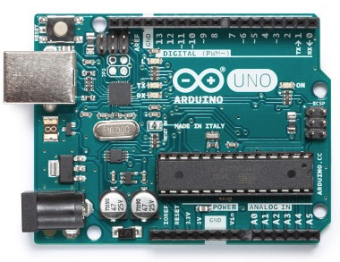
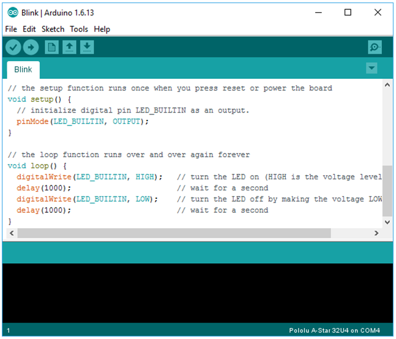
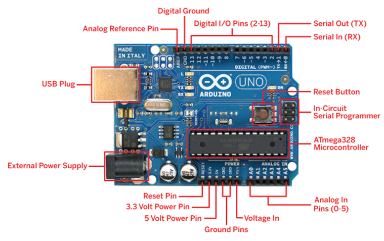
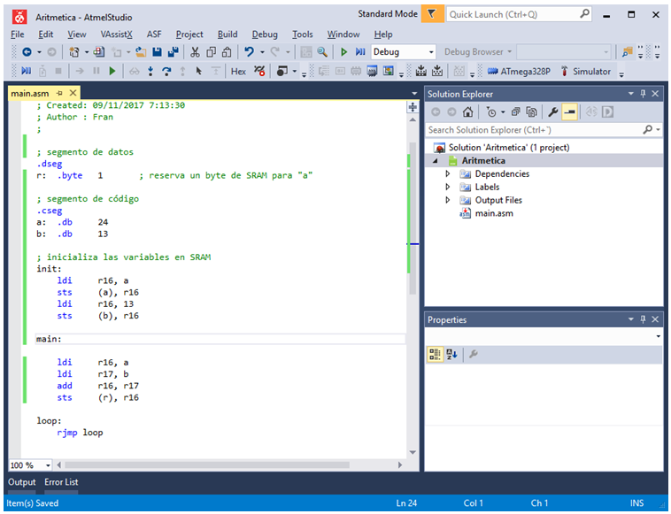
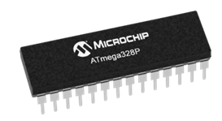
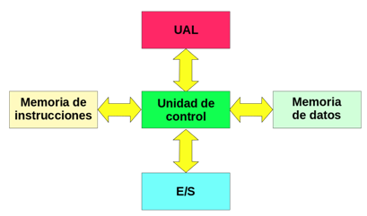
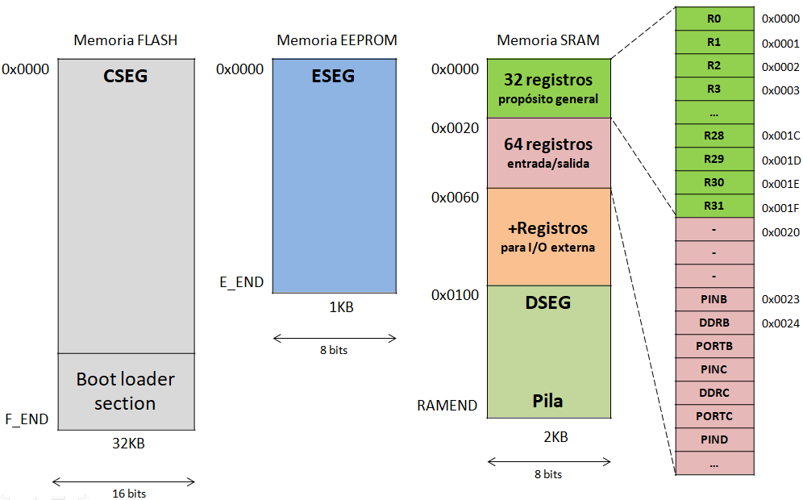

**Arduino UNO** es una placa de circuito impreso con un microcontrolador [**ATmega328p**](http://www.microchip.com/wwwproducts/en/ATmega328p). Este microcontrolador es desarrollado por la compañía **Atmel** (ahora Microchip) y su arquitectura es **AVR**.



Arduino ofrece un [entorno de desarrollo](https://www.arduino.cc/en/Main/Software) (IDE) para programar el microcontrolador en el lenguaje C:



Pero en esta veremos como programarla a bajo nivel (en **ensamblador**).

## Estructura de la Arduino UNO



## Atmel Studio

**Atmel Studio** es el entorno de desarrollo (IDE) que ofrece la compañía Atmel para programar sus microcontroladores. Este entorno permite programar tanto en lenguaje C como en ensamblador, así como ofrece la posibilidad de depurar (debug) nuestros programas, pudiendo analizar los cambios que se producen en el interior del microcontrolador (registros, puestos de entrada/salida, ...).



Podemos descargarlo desde el siguiente [enlace](http://www.atmel.com/microsite/atmel-studio/).

## Especificaciones del ATmega328P

El ATmega328P es un microcontrolador RISC de 8 bits de la familia AVR.



| Parámetro            | Valor                                    |
| -------------------- | ---------------------------------------- |
| Velocidad máxima     | 20 Mhz (16Mhz en la Arduino)             |
| Encapsulado          | PDIP de 28 pines (Plastic Dual Inline Package) |
| Registros            | 32                                       |
| Líneas de E/S (GPIO) | 23                                       |
| Arquitectura         | Harvard (memoria para instrucciones y para datos separadas) |
| Memoria FLASH        | No volátil de 32KB para instrucciones (programas). |
| Memoria SRAM         | Volátil de 2KB para datos.               |
| Memoria EEPROM       | No volátil de 1KB para datos.            |



Ficha técnica del microcontrolador disponible en este [enlace](http://www.atmel.com/Images/Atmel-42735-8-bit-AVR-Microcontroller-ATmega328-328P_Datasheet.pdf).

### Registros de propósito general

- Al ser un microcontrolador RISC dispone de hasta 32 registros de propósito general.
- Estos se llaman `Rd`, con `d` entre 0 y 31: `R0`, `R1`, `R2`, …, `R31`
- Los registros sealmacenan en los primeros 32 bytesde la SRAM.
- No todos los registrosse pueden usar para todas las operaciones.

> Se recomienda utilizar del R16 al R31.

### Organización de las memorias



## Ensamblador AVR

### Estructura básica de un programa

La siguiente es la estructura básica de un programa en ensamblador AVR:

```asm
/*
 * Esto es un 
 * comentario 
 * multilínea
 */ 

; esto es un comentario de una línea

; segmento de datos EEPROM
.eseg
	; aquí reservamos memoria para nuestras variables persistentes

; segmento de datos SRAM
.dseg 
    ; aquí reservamos memoria para nuestras variables volátiles

; segmento de código
.cseg
    ; aquí escribimos las instrucciones de nuestro programa
```

Mediante las directivas `.cseg`, `.dseg` y `.eseg` estructuramos nuestro programa:

- `.cseg` marca el comienzo del segmento de código (memoria FLASH)
- `.dseg` marca el comienzo del segmento de datos volátiles (memoria SRAM)
- `.eseg`  marca el comienzo del segmento de datos persistentes (memoria EEPROM)

> Las directivas aportan información al compilador y su nombre siempre empieza por un punto (`.`)

### Primer programa en ensamblador AVR

```asm
/*
 * Mi primer programa
 * 1) Pone un 24 en R16 
 * 2) Pone un 87 en R17
 * 3) Decrementa R16 (R16 <- R16 – 1)
 * 4) Vacía R16 (R16 <-0)
 */

; segmento de código
.cseg

main:				; etiqueta (nombre seguido de :)
    ldi   r16, 24  	; R16 <- 24
    ldi   r17, 87  	; R17 <- 87
    dec   r16  		; R16 <- R16 - 1
    clr   r16  		; R16 <- 0

loop:
    rjmp loop  		; salta a la etiqueta "loop"(bucle infinito)
```

> El bucle infinito al final del programa impide que la unidad de control siga
> ejecutando lo que hay en las direcciones de memoria FLASH consecutivas a
> nuestro programa, lo que produciría un comportamiento aleatorio e inesperado
> del microcontrolador.