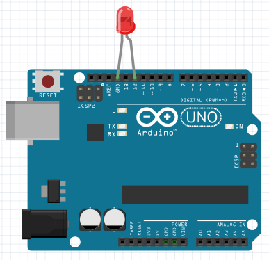

El proyecto consiste en hacer parpadear (encender y apagar) el led conectado al pin 12 de la Arduino UNO. 

Esquema físico del proyecto:



Programa en ensamblador AVR:

```asm
;
; LedIntermitente.asm
;

.cseg

	; configura el pin 4 del puerto B como salida (pin 12 de la Arduino)
	ldi	r16, 0b00010000
	out	DDRB, r16

loop:
	; activa el pin 4 del puerto B (enciende el led)
	sbi	PORTB, 4
	; llama al método "delay" (espera 1 segundo)
	call	delay
	; desactiva el pin 4 del puerto B (apaga el led)
	cbi	PORTB, 4
	; llama al método "delay" (espera 1 segundo)
	call	delay
	; repite el proceso
	jmp	loop

; método "delay" (espera 1 segundo aproximadamente)
delay:
	push	r16
	push	r17
	push	r18
	push	r19

	ldi	r16,3		; itera 3.000.000 de veces
	ldi	r17,100		; ~1.0s at 16Mhz
	ldi	r18,100		
	ldi	r19,100		
repite:
	dec	r19
	tst	r19
	brne	repite
	ldi	r19,100

	dec	r18
	tst	r18
	brne	repite
	ldi	r18,100

	dec	r17
	tst	r17
	brne	repite
	ldi	r17,100

	dec	r16
	tst	r16
	brne	repite

	pop	r19
	pop	r18
	pop	r17
	pop	r16
	ret
```
