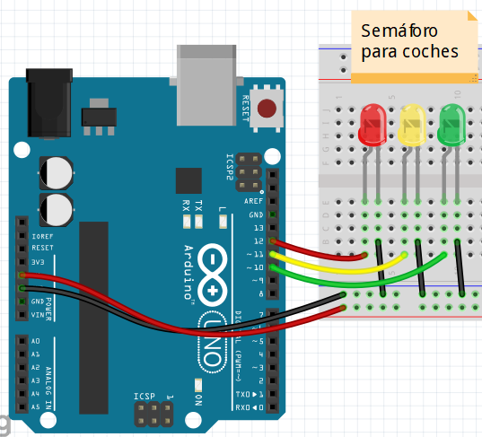

El proyecto consiste en implementar un semáforo con tres leds conectados a los pines 12, 11 y 10 de la Arduino UNO.

Esquema físico del proyecto:

Deberás implementar en ensamblador de AVR el programa que haga el sistema se comporte de la siguiente manera:

1. Se activará el led **ROJO** durante **5seg.** aproximadamente, mientras AMARILLO y VERDE están apagados.
2. Se activará el led **AMARILLO** duranate **2seg.** aproximadamente, mientras ROJO y VERDE están apagados.
3. Se activará el led **VERDE** durante **5seg.** aproximadamente, mientras ROJO y AMARILLO están apagados.
4. Volver al punto 1.

