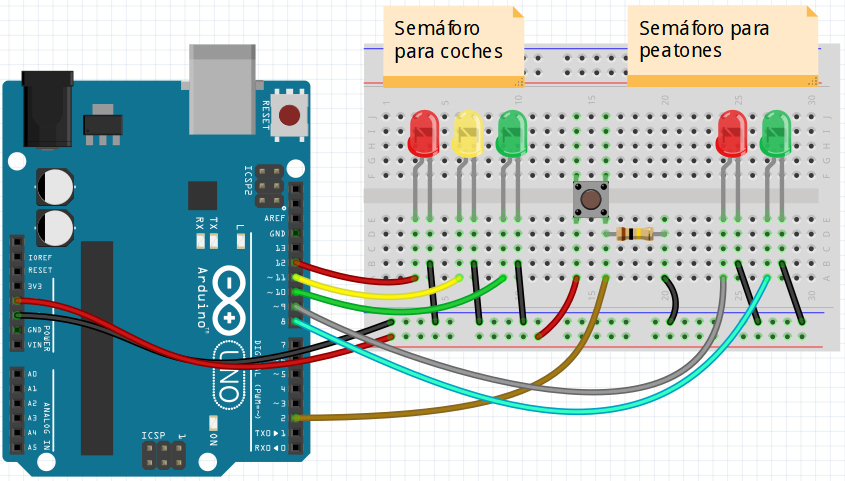

El proyecto consiste en implementar un semáforo para coches con 3 LEDs y otro para peatones con 2 LEDs,  de forma que el semáforo de peatones sólo se activará si se pulsa el botón.

Esquema físico del proyecto:

Deberás implementar en ensamblador de AVR el programa que haga el sistema se comporte de la siguiente manera:

1. Se activará el led **VERDE** del semáforo para coches, el **ROJO** para peatones y el resto apagados.
2. Si se ha pulsado el botón, continua en el paso 3. Repite el paso 1.
3. Se activará el led **AMARILLO** del semáforo para coches durante 2 segundos, el **ROJO** para peatones y el resto apagados.
4. Se activará el led **ROJO** del semáforo para coches y el **VERDE** de peatones durante 5 seg, y el resto apagados.
5. Parpadeará el led **VERDE** de los peatones durante 3 seg., se dejará **ROJO** de coches activado, y el resto apagados.
6. Volver al punto 1.

