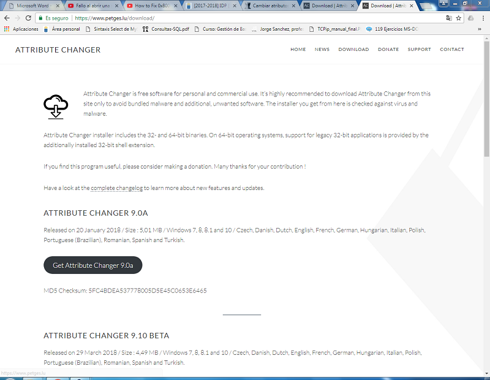
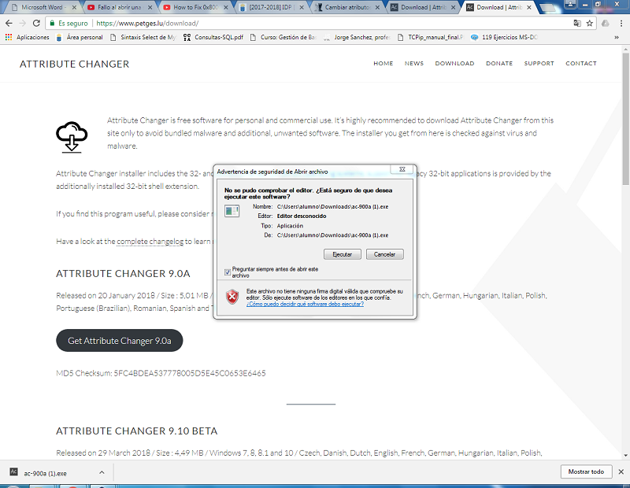
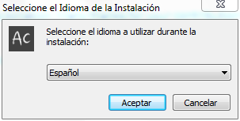
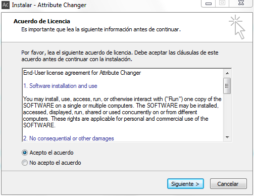
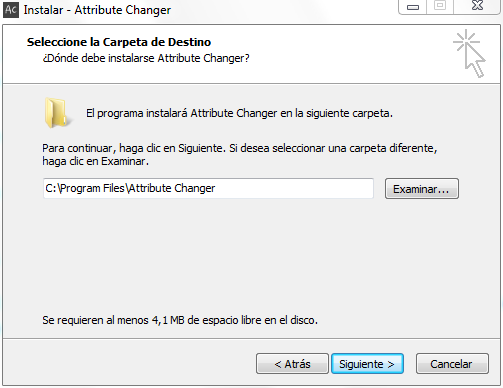
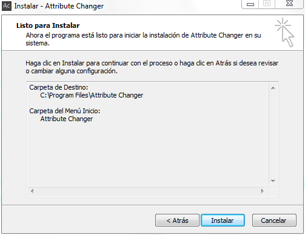
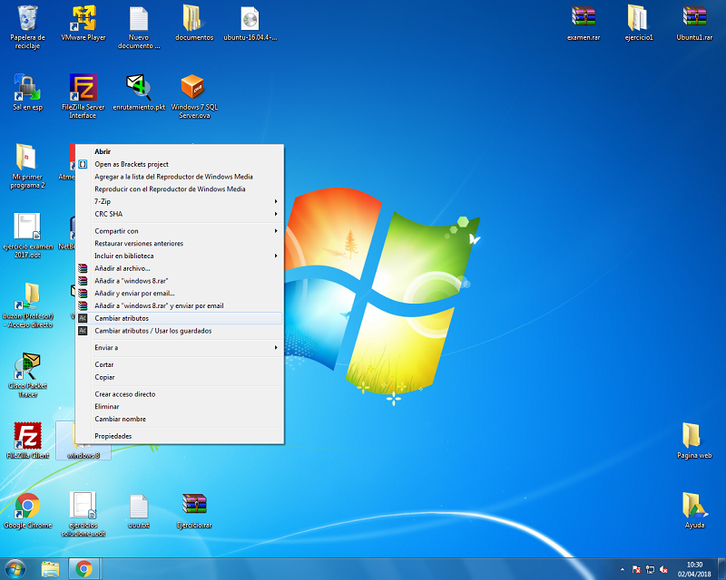
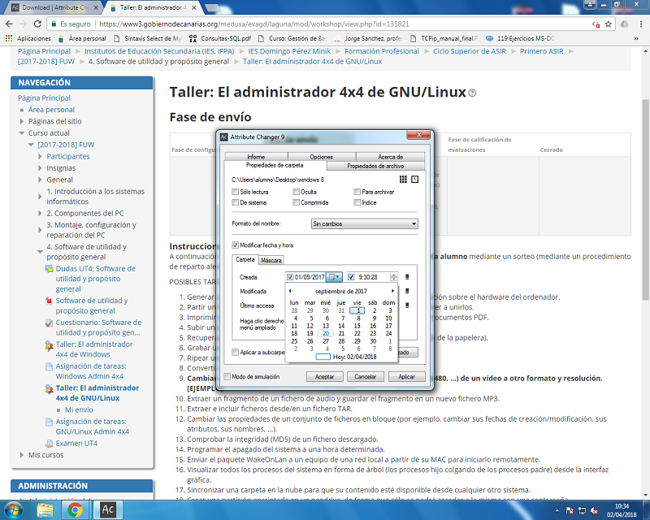

1. Abrir un navegador y acceder al sitio web de descarga de [AttributeChanger](https://www.petges.lu/download/):

   

2. Pulsamos el botón **Get AttributeChanger**

   

3. Al finalizar la descarga, ejecutamos el instalador y lo primero que hacemos es seleccionar el idioma:

   

4. Aceptamos el acuerdo y pulsamos **Siguiente**: 

   

5. Elegimos donde quieres que se te guarde el programa:

   

6. Finalmente, pulsamos **Instalar**:

   

7. Ahora sólo tenemos que seleccionar las carpetas o archivos de los que queramos cambiar los atributos, desplegamos el menú contextual y elegimos la opción **Cambiar atributos**

   

   En este caso se ha cambiado la fecha de creación de una carpeta, pero hay muchas mas opciones que se pueden cambiar:

   

## Autor

* Daniel Rodríguez Delgado