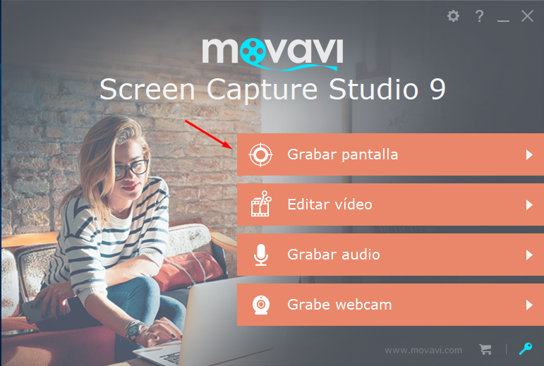
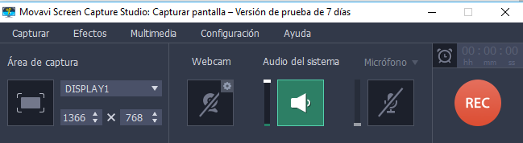

1. Descargar e instalar la aplicación desde la página web [Movavi](https://www.movavi.com "Movavi"). 

2. Hacemos clic en "Download for free".

   

3. Una vez instalada, aparecerá un menú como el siguiente, donde pulsamos **Grabar pantalla**:

   

   

Y eso es todo, no hay más, simplemente darle al botón **REC** y empezaría a grabar, podremos escoger entre el audio del sistema o el micrófono de nuestro equipo o externo.

Vídeo de [demostración](imagenes/ejemplo.mp4).

## Entorno utilizado: 

* Sistema operativo: Windows 10 (64 bit)
* Microprocesador: Intel Celeron N2840
* Memoria RAM: 4GB DDR3L
* Disco duro: 500GB

## Autor

* Daniel de la Torre Bueno
