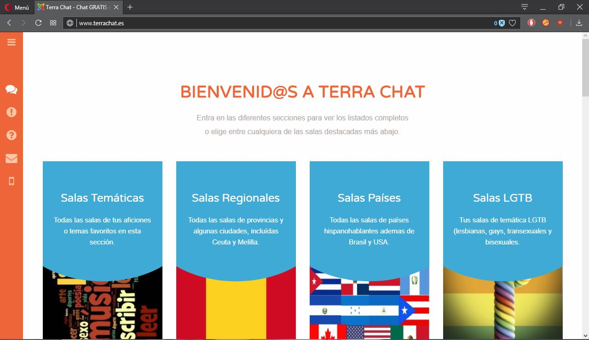
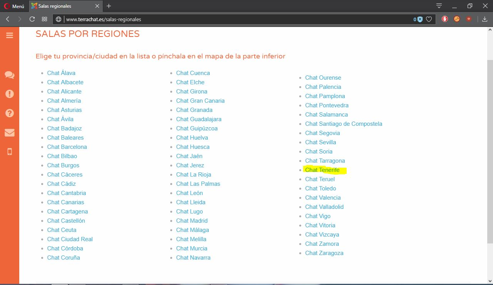
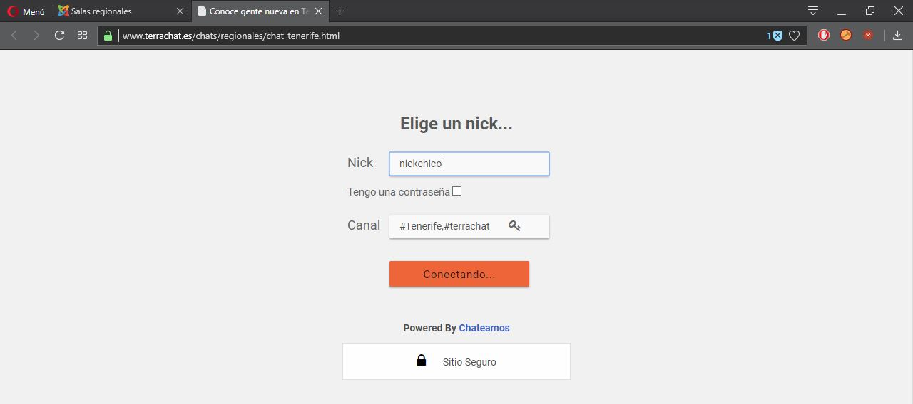
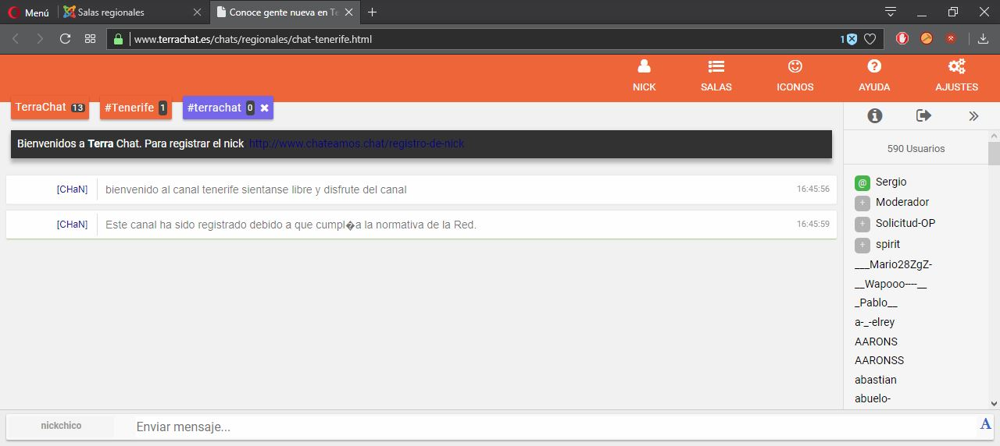
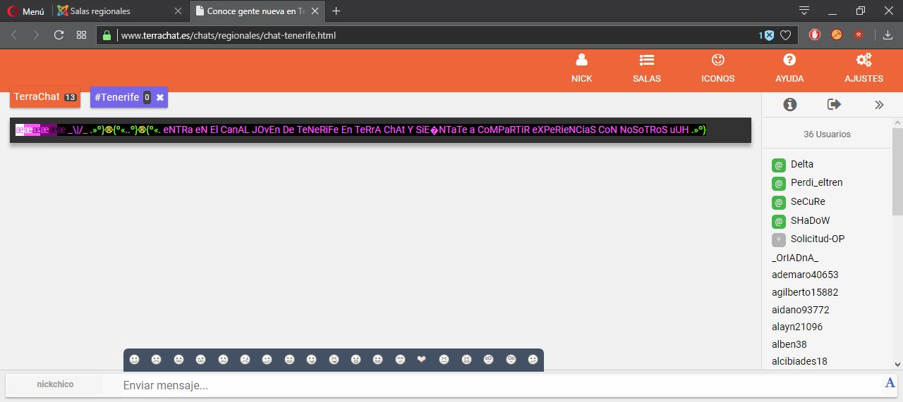
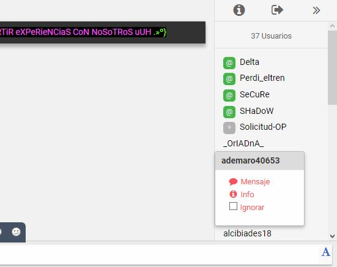
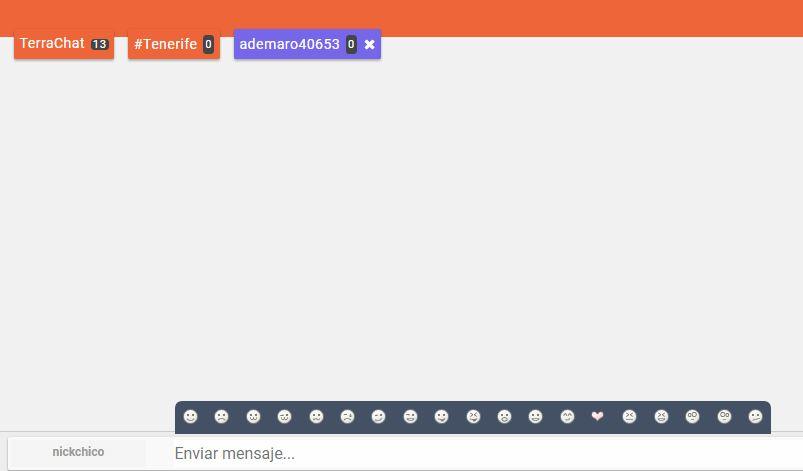
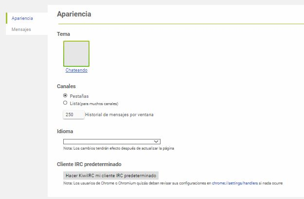
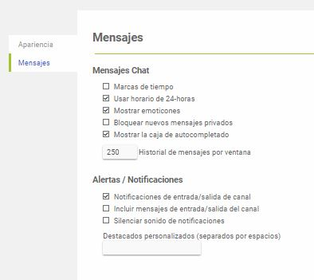

1. Lo primero que debemos hacer es buscar un chat en Google (por ejemplo); en este caso buscaremos el chat de Terra.

   

2. Nada más clicar en el enlace a la página veremos esto: 

   

3. Podremos seleccionar el tipo de sala que mas de adecue a nuestros deseos, en este caso seleccionaremos salas regionales y veremos lo siguiente:

   

4. Seleccionaremos "Chat Tenerife" para nuestro ejemplo.

   

5. Después de clicar en "Chat Tenerife" deberemos elegir un nick y pulsar en conectar.

   

6. Así ya estariamos dentro del canal, solo tendríamos que seleccionarlo en la pestaña de arriba puesto que entra a algún canal más.

   

7. Si pulsamos en en la parte de arriba donde pone "ICONOS" nos aparecería una bandeja de iconos que podemos enviar en nuestras conversaciones.

   

8. Si hacemos clic derecho sobre el nick de una persona en la zona derecha se abre un menú desplegable en el que podemos hablar en privado con dicha persona.

   

   Simplemente se abriría otra pestaña como la del canal y se sumaría a las pestañas de la parte de arriba.

9. Después tendríamos la pestaña de opciones en la que encontraríamos diferentes opciones de apariencia y de la ventana de mensajes. 

   

   

## Autor

* Juan Manuel Brocal Braun