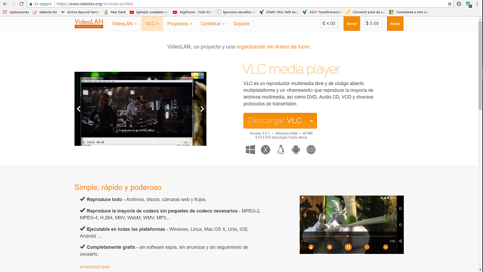
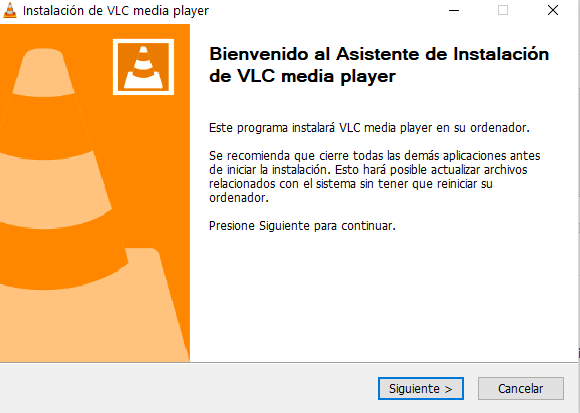
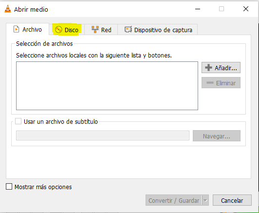
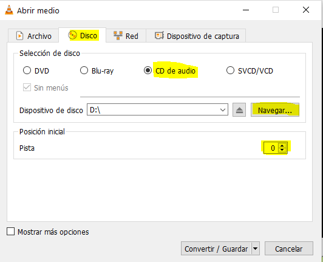
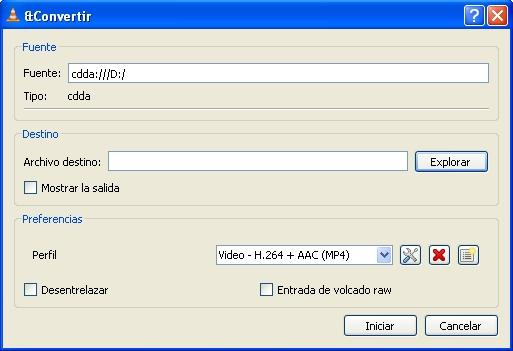
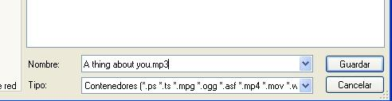
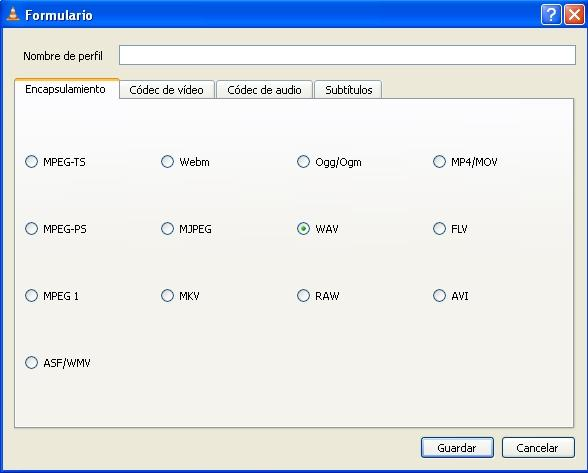
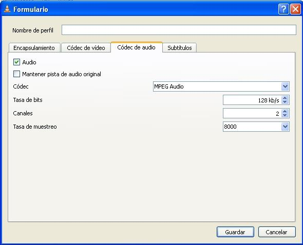
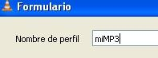
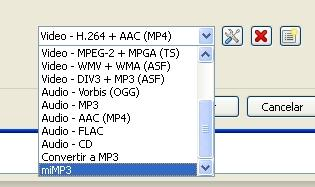

## ¿Tienes un CD de música de tu infancia que te encanta y  no sabes como guardar la información?

Aunque no lo parezca, el **VLC Player** nos permite "ripear" (copiar el contenido) un CD de audio en ficheros con formato MP3.

### ¿Qué es VLC Player?  

El reproductor multimedia VLC PLAYER completamente gratuito permite convertir una a una las pistas de audio o canciones almacenadas en un CD a formato MP3 o extraer el sonido de un archivo de vídeo. 

> Los usuarios de Windows también pueden recurrir a  Windows Media Player para convertir un CD de audio a MP3.

## Cómo usar VLC Player

### Descarga

La descarga de la aplicación es directamente desde su pagina web, así que esté completamente libre de virus: [https://www.videolan.org/vlc/index.es.html](https://www.videolan.org/vlc/index.es.html).

### Instalación 

El instalador es bastante simple y no instalará nada a parte del programa que quieres usar.

### Ripeo

1. Abrimos el reproductor y accedemos a la opción **Convertir** del menú **Medio:**

	

2. Hacemos clic en la pestaña **Disco**.

	

3. En el panel **Selección de disco** marcamos la opción **CD de audio**. Luego en **Dispositivo de disco** indicamos la unidad que representa el reproductor de CD, y en la posicion inicial se debe indicar el numero de pista que se desea convertir a MP3 (siempre ponerlo a 1), y pulsamos el botón **Convertir**.

	

4. En la siguiente ventana, debemos hacer clic en el botón **Explorar** para indicar la ubicación y nombre del fichero (incluyendo la extensión `mp3`) donde guardará el archivo una vez convertido. 

	> No olvides indicar al final del nombre del archivo la extensión del fichero, ya que de lo contrario no funcionara.

	

	

	

5. Dentro del apartado **Preferencias** hacemos clic en el botón **Crear un nuevo perfil** (tercero por la izquierda o primero de la derecha).

	

6. En la pestaña **Encapsulamiento** seleccionamos WAV (formato de audio sin compresión de datos.)

	

7. En la pestaña códec de audio indicamos los siguientes valores (corresponden a la calidad CD en formato MP3).

	

8. Establecemos un nombre para el perfil y hacemos clic en Guardar.

	

9. Seleccionamos en el cuadro desplegable el perfil nuevo creado y hacemos clic en el botón **Iniciar**.

	

10. Y VLC se pondra manos a la marcha y convertira el archivo, y por consiguiente dejarlo en la dirección que habeis marcado.

## Autor

* José Rafael Rodríguez