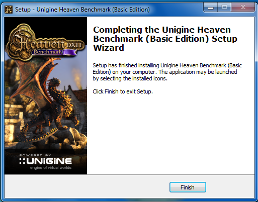
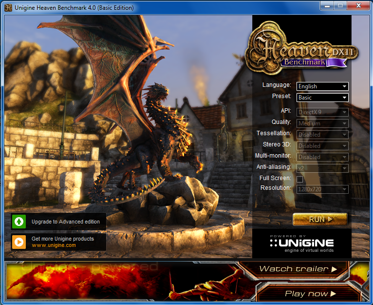
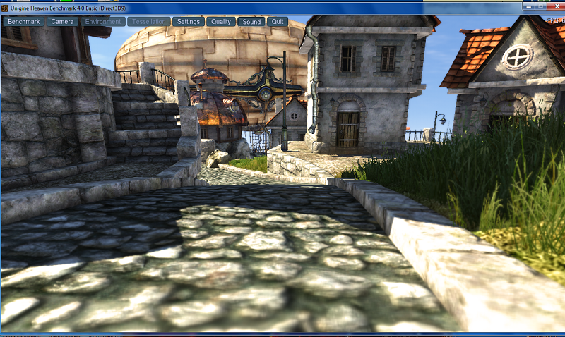
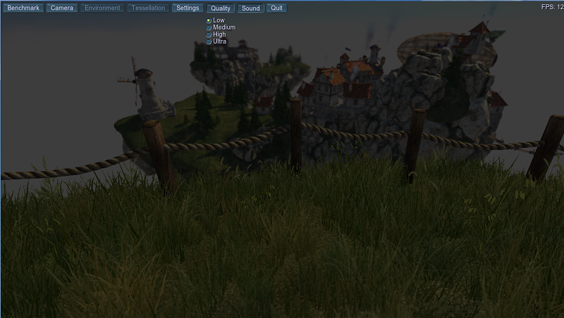
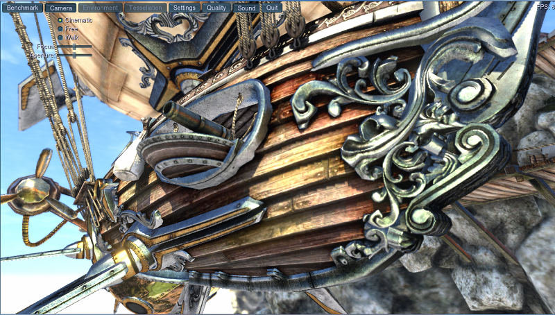
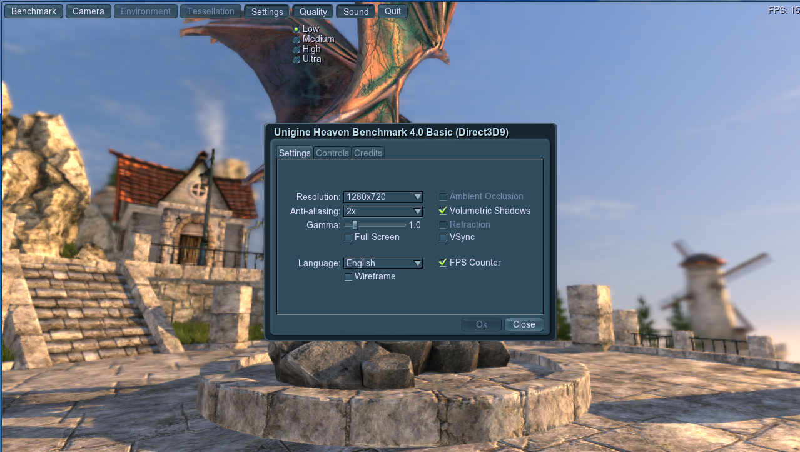
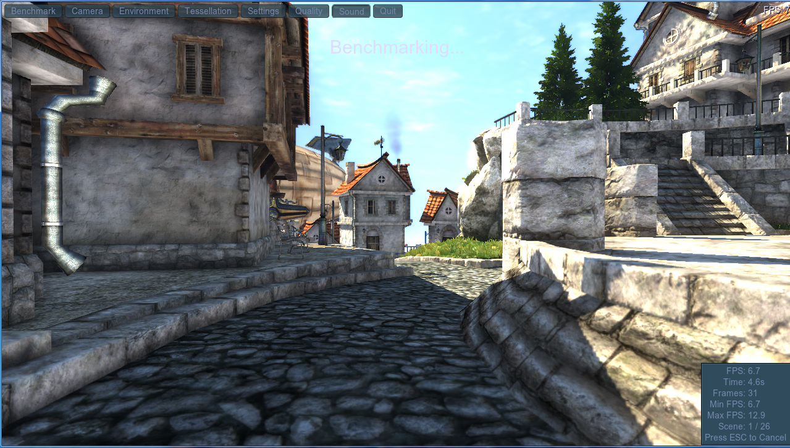
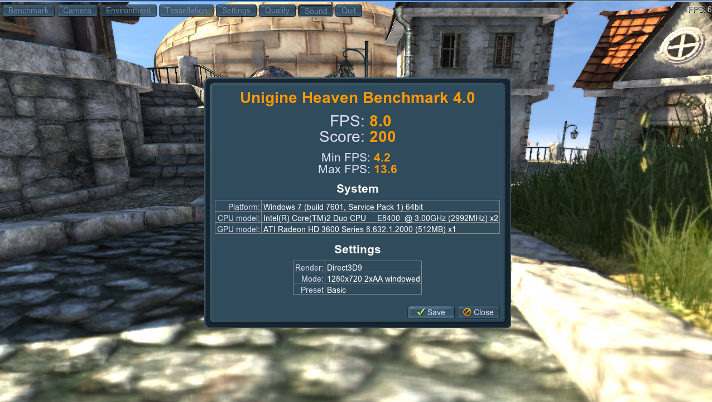

Para realizar una prueba de rendimiento de nuestra tarjeta gráfica usaremos **Heaven Benchmark**.

Enlace descarga: [Heaven Benchmark](https://benchmark.unigine.com/heaven)

1. Descargarnos el programa de la web de su desarrollador.

   

2. Lo instalamos:

   

3. Lo ejecutamos, y nos encontramos con la siguiente pantalla, donde podemos configurar el tipo de prueba que vamos a realizar (en este caso usaremos los preajustes básicos).

   

4. Pulsamos el botón **RUN** y veremos que se inicia algo parecido a un videojuego. En la parte de arriba tenemos unas pestañas que nos permiten configurar la prueba así como detenerla.

   

5. Configuramos la calidad de la prueba (Quality).

   

6. Ajustamos la cámara del "videojuego" (Camera).

   

7. Cambiamos los ajustes generales (algunos ajustes gráficos y controles)

   

8. Una vez terminada la configuración de la prueba pulsamos sobre **Benchmark**, para que comience el test de rendimiento.

   

   Como se puede ver en la esquina inferior derecha aparece un recuadro en el que va detallándonos los datos de la prueba mientras la realiza.

9. Al terminar nos mostrará un recuadro con los resultados de la prueba junto a los ajustes que hayamos usado.

   

## Autores

* Juan Manuel Brocal Braun 
