## Benchmark

Según la [Wikipedia](https://es.wikipedia.org/wiki/Benchmark_(inform%C3%A1tica)): *"Benchmark, es una técnica utilizada para medir el rendimiento de un sistema o uno de sus componentes"*.

## Software de benchmarking de GPU

En este tutorial vamos a utilizar tres aplicaciones diferentes para realizar pruebas de rendimiento de nuestra tarjeta gráfica (GPU).

| Aplicación                | **URL**                                   |
| :------------------------ | :---------------------------------------- |
| Unigine Benchmarks        | <http://unigine.com/products/benchmarks/> |
| 3D Mark                   | <http://www.3dmark.com/> y Steam          |
| Resident Evil 6 Benchmark | Disponible en Steam                       |

### Unigine Benchmark

1. Dentro de la página tenemos varias opciones de productos. En nuestro caso, nos decantamos por el Valley.

	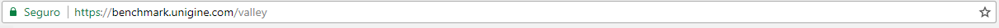

	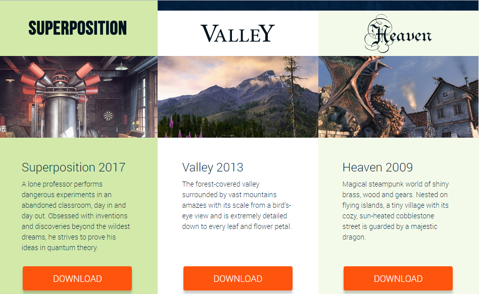

	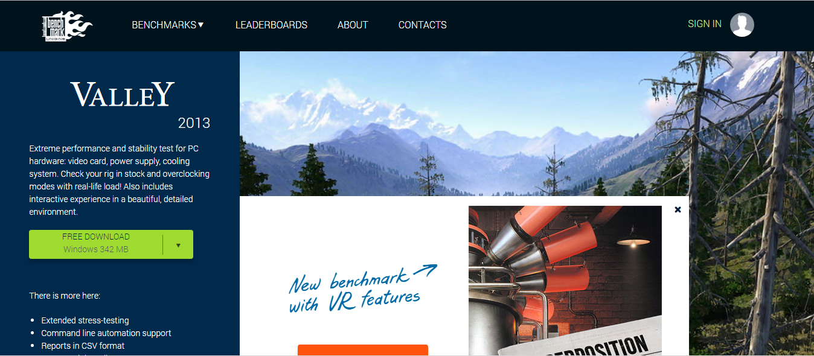

2. Seguimos los pasos correspondientes a la instalación.

	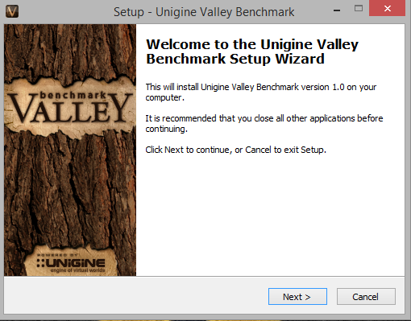

3. Ya dentro del software, cambiaremos las opciones ofrecidas para conocer, en este caso; el máximo rendimiento de la tarjeta gráfica.

	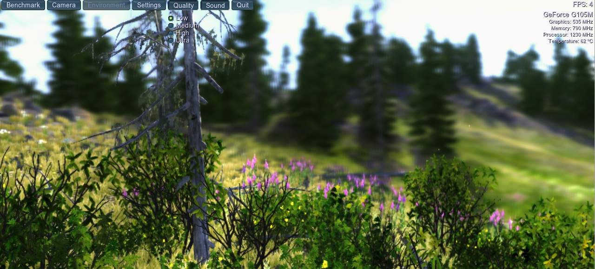

	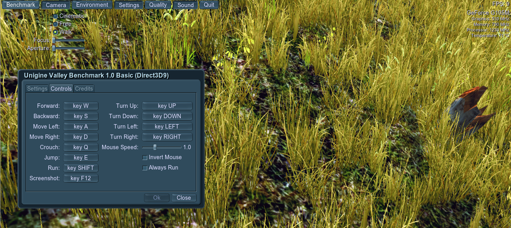

3. Iniciamos la prueba de rendimiento pulsando el botón "Benchmark" de la esquina superior izquierda.
	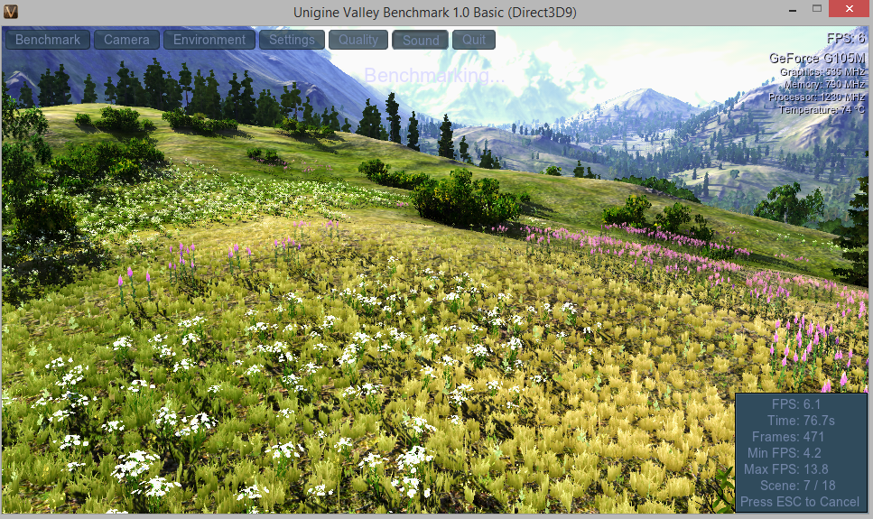

### 3D MARK

Esta aplicación podemos tanto descargar desde el sitio web de su desarrollador como a través de Steam:

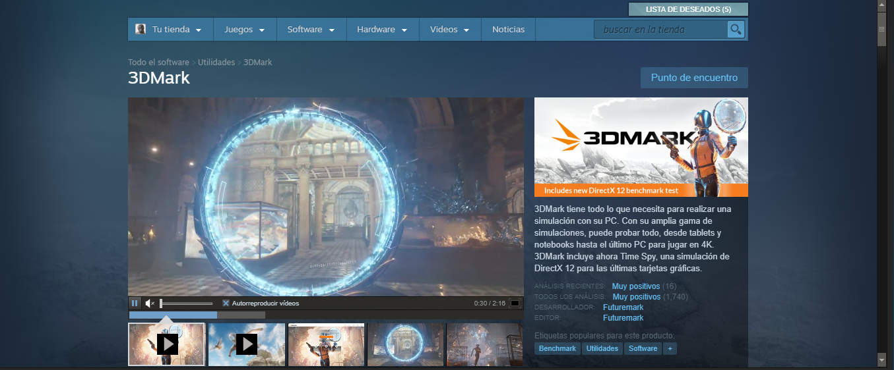

En este caso se trata de un software de pago:

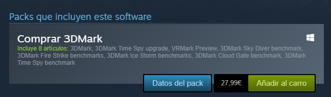

### Resident Evil 6 Benchmark

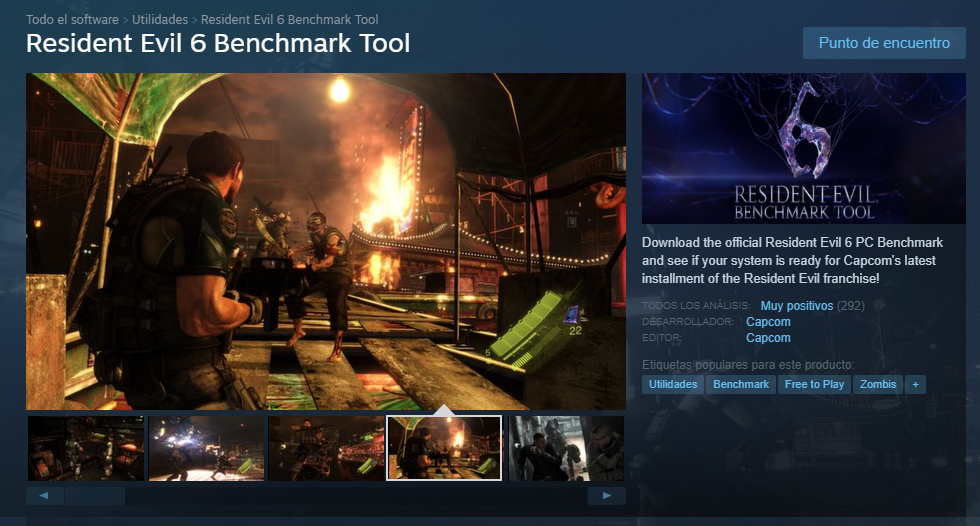

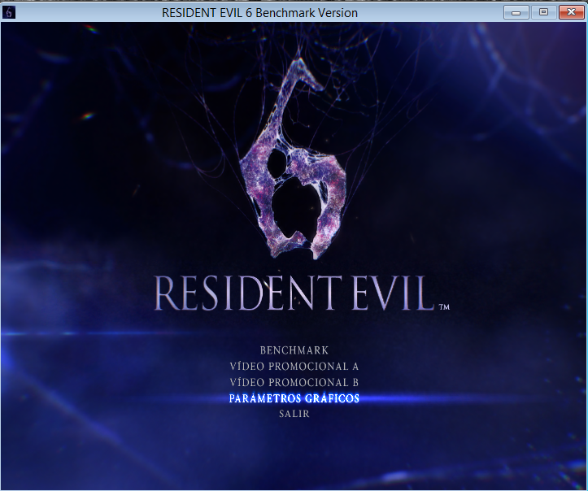

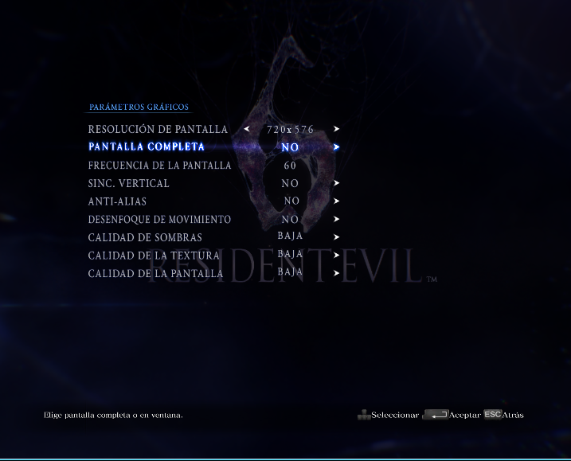

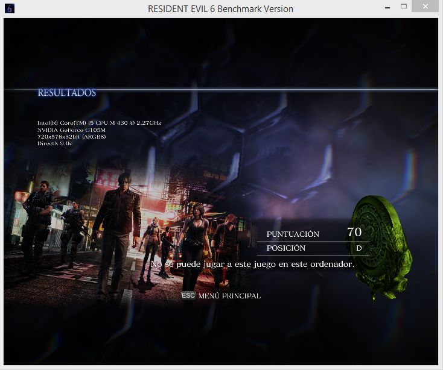

## Autores

* Melissa Dávila Martín
* David Zamorano Alonso
