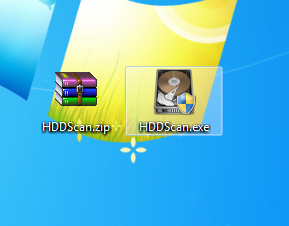

Existen varias herramientas que nos permiten detectar los errores que pueden ocurrir en nuestro disco duro. Nosotros hemos elegido el programa HDDScan, el cual te avisa sobre excesos de temperatura, muestra la información S.M.A.R.T. y tiene **diversos tests de verificación, lectura y borrado de datos.**
Además cuenta con una función interesante, como es el **análisis de daño de transporte**, para comprobar que el disco duro sigue en buen estado tras un viaje.

Es un programa portátil, por que tampoco requiere de instalación y podrás llevarlo siempre contigo.

## Instalación

1. Descargamos la aplicación del siguiente enlace:

   [https://hddscan.com](https://hddscan.com)

   Aquí debemos pulsar el botón rojo: **DOWNLOAD**.

    

2. Una vez descargado, extraemos el fichero **HDDScan.exe** del ZIP:

   

3. Y ya tenemos el ejecutable con el programa (en nuestro caso, en el Escritorio de Windows):

## Uso

1. Iniciamos el programa, y una vez dentro aceptamos los términos de uso:

2. Elegimos la opción **S.M.A.R.T.** para realizar un análisis general del estado de nuestro disco duro. 

3. Como resultado se nos creará un informe con todas las especificaciones y atributos, y podremos observar si su estado y si el valor se encuentra en un rango correcto.

Y esta es la principal función del programa con la que podemos analizar nuestro disco duro y detectar cualquier error que pudiese tener.    

## Autores

* Alberto Gutiérrez Delgado
* Daniel Rodríguez Delgado