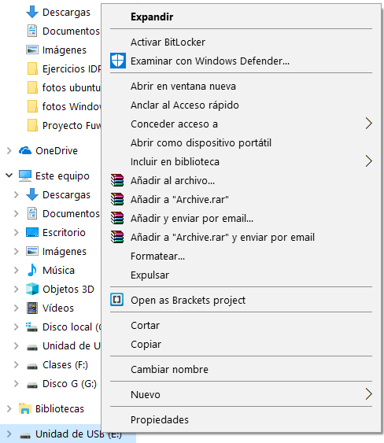
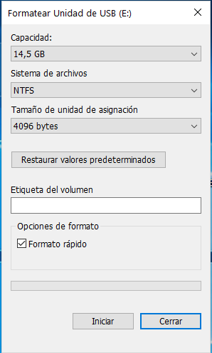
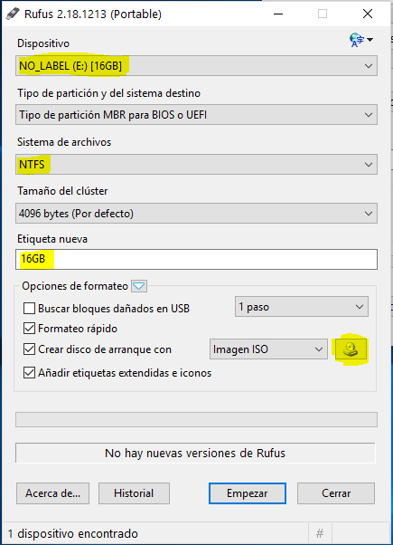
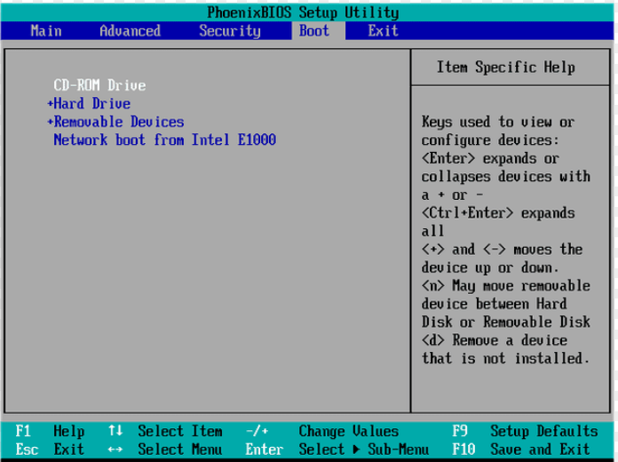
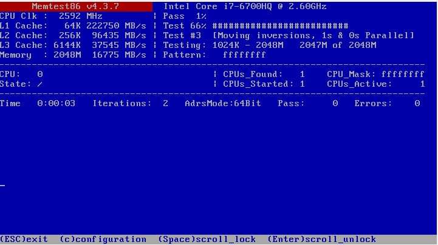
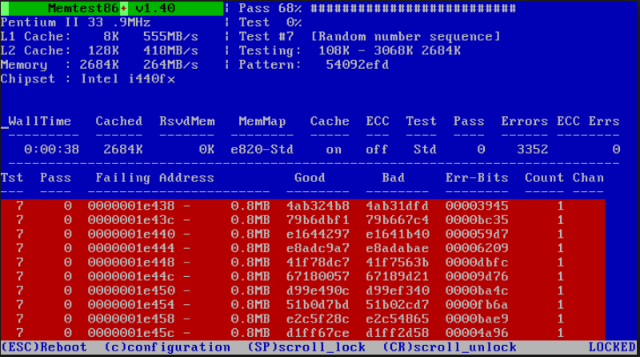

## Herramientas que vamos a utilizar

#### Programa que nos facilite el booteo de un USB:

Utilizaremos el Rufus ya que es un software completamente gratuito y sencillo de utilizar. 

Link de descarga: https://rufus.akeo.ie/?locale

#### Programa para diagnosticar la RAM 

Utilizaremos el Memtest que es otro software gratuito.

Link de descarga: https://www.memtest86.com/download.htm

## Crear un pendrive booteable

1. Después de habernos descargado rufus tendremos que formatear por completo nuestro pendrive. Dándole a formatear.

2. Se nos abrirá una pestaña allí tendremos que dejarlo como sistema de archivos NTFS (usaremos este tipo de sistema ya que nos permite mover mas de 4gb a la vez) y iniciar.

3. Luego iniciaremos el Rufus para instalar la iso (Memtest86), En el tendremos que buscar la iso dentro de nuestro ordenador (donde se descargo Memtest86) dando click a la foto del disco marcada en la imagen y le daremos a empezar, ya tendremos el pendrive booteado.

## Iniciar el pendrive desde la BIOS

Antes de empezar a diagnosticar nuestro ordenador lo primero que tenemos que hacer es entrar a la bios (F1, F2, F8, F12, Ctrol, Tabulador, depende del ordenador) de nuestro ordenador y asignarle al pendrive que hemos booteado como inicio preferente.

## Qué es Memtest86 y cómo se usa

**Memtest86+** es un programa de código abierto que se ejecuta desde un dispositivo independiente. Por lo tanto puede ser utilizado en cualquier sistema operativo. Este programa te permite hacer un diagnostico a fondo de la memoria RAM de tu PC. Como observamos en la imagen de debajo nos ira haciendo testeos continuos para descubrir los errores de las memorias RAM.

Los errores en memtest86 son bastante sencillos de ver (imagen inferior) si los tienes es que la memoria ram esta teniendo fallos.

## Autores

* Airam Arteaga
* José Rafael Rodríguez Estévez