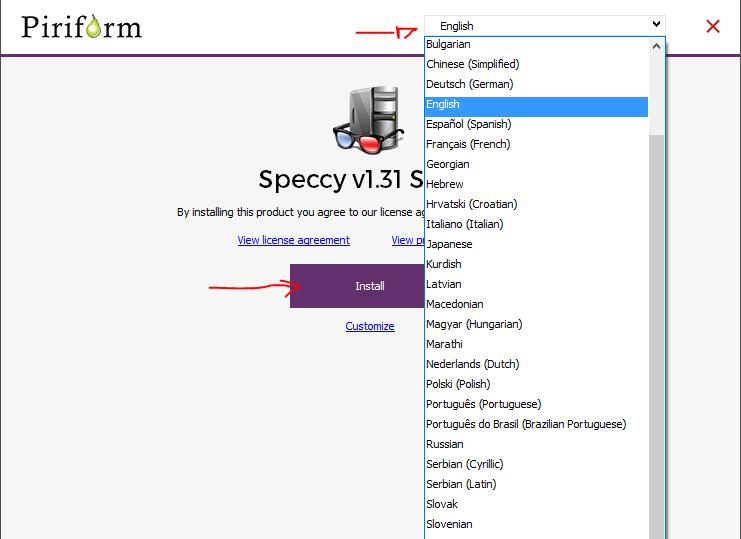
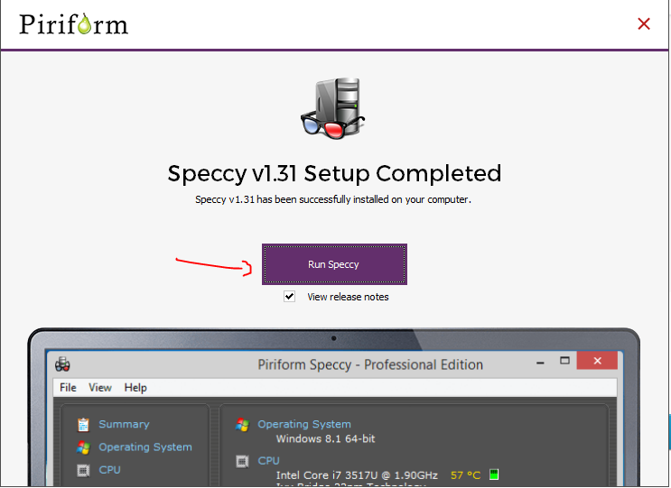
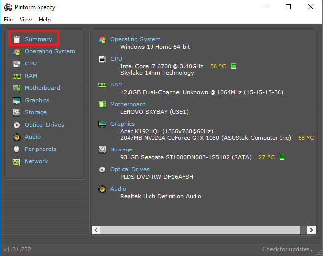
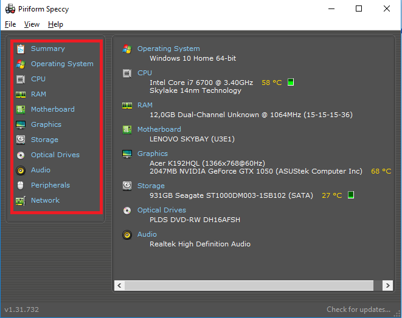

En este tutorial explicaremos como averiguar el hardware del equipo que estemos usando. Para ello vamos a utilizar **Speccy**.

## Descarga e instalación

Enlace de descarga: [https://www.ccleaner.com/speccy/download](https://www.ccleaner.com/speccy/download)

1. Accedemos a la web desde la que lo queramos descargar y nos da dos opciones:

  

2. Si elegimos **CCleaner.com** la descarga se hará de forma automática. 

3. Luego iniciamos el instalador.

4. Seleccionamos el idioma y pulsamos en **Install**.

5. Cuando finalice nos aparecerá la notificación de que la instalación se ha completado correctamente y ejecutaremos el programa:

## Uso

Tras la instalación de Speccy procedemos a "averiguar" cúal es el hardware de nuestro equipo, para ello, seguiremos los siguientes pasos:

1. Abrimos Speccy y esperamos a que este analice un resumen (*Summary* dentro de la aplicación) del hardware que indica los fabricantes y la característica principal de cada componente.

	

> NOTA: para ver los periféricos o la tarjeta de red deberás seguir el paso siguiente.

2. Si queremos ver información más específica simplemente pulsamos en el menú de la izquierda el componente deseado.

   

Y con esto finalizaría el tutorial.

## Autores 

* Jorge Zanón
* Raúl Méndez