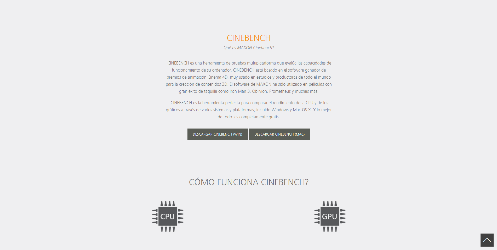
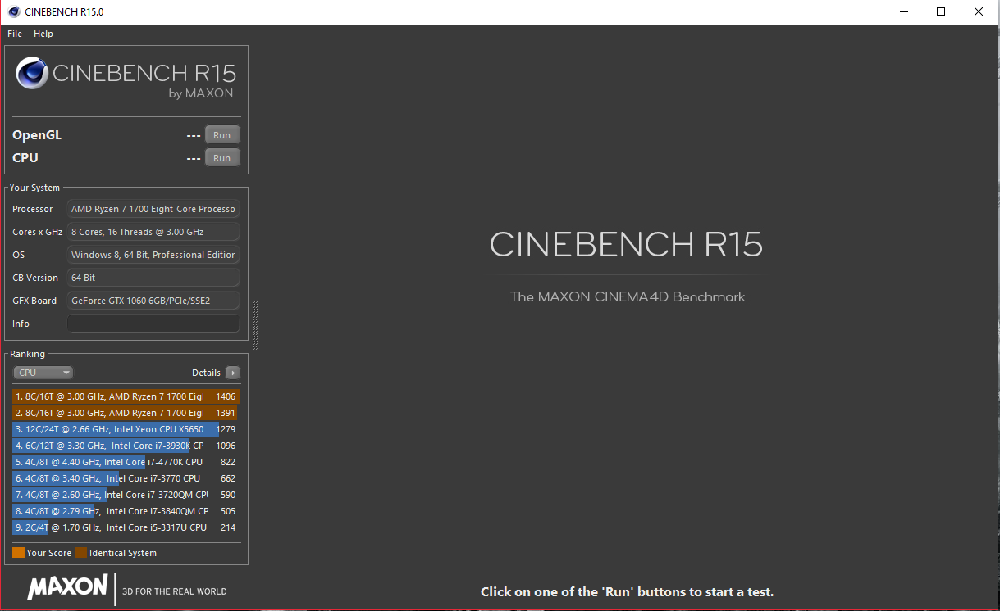
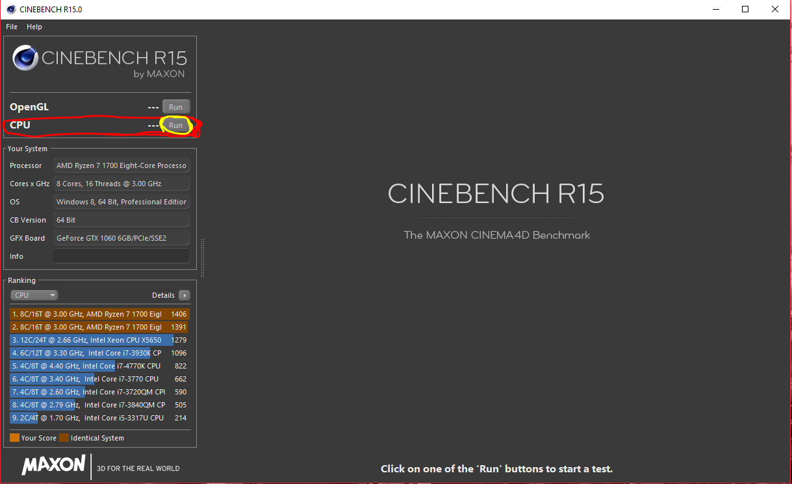
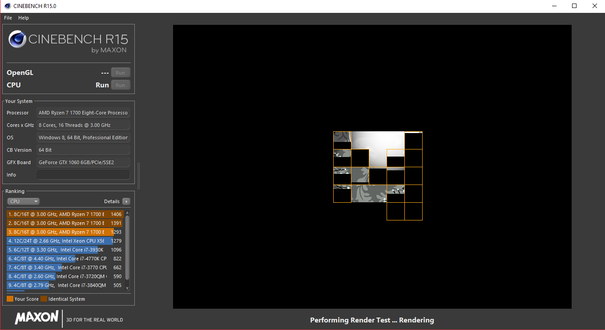
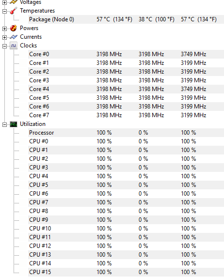
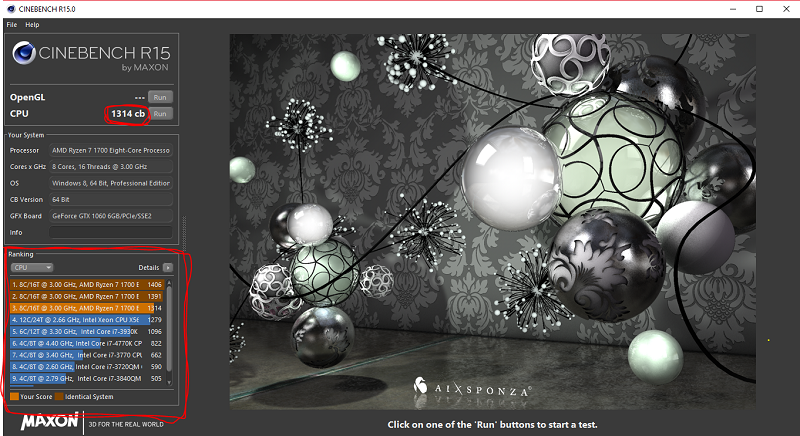

## Programas utilizados

* Cinebench
* HWMonitor

## Pasos a seguir

1. Descargamos la aplicacion [Cinebench](https://www.maxon.net/es/productos/cinebench/) de su página oficial. Al entrar en el link nos encontraremos esta ventana, y bajamos hasta encontrar los enlaces de descarga:

>  Veremos dos enlace, uno para Windows y otro para Mac.

2. Abrimos la aplicación una vez descargada:

3. Pulsamos Run para iniciar la prueba de estrés de la CPU:

​	De esta forma empezará el programa a estresar la CPU: 

5. El uso de nuestra CPU y los valores de los sensores de temperatura los podemos controlar utilizando [HWMonitor](https://www.cpuid.com/softwares/hwmonitor.html) mientras se realiza la prueba.

6. Finalizada la prueba estrés de nuestra CPU,  podemos ver como nos da una puntuación, metiéndola en un ranking con otros procesadores similares:

### CPU estresada en Cinebench

* AMD Ryzen 7 1700

## Autores

* Aitor Javier Santos González
* Daniel Martín Rodríguez