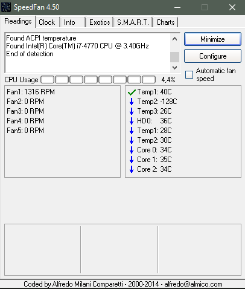
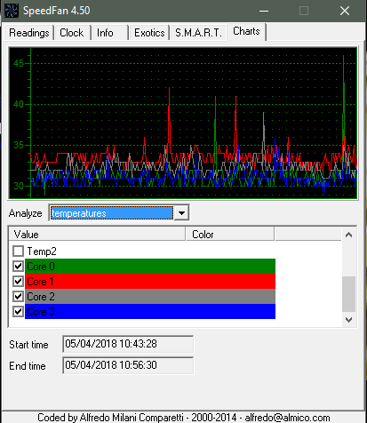

Para conocer tanto la temperatura captada por los sensores del PC como la velocidad (RPM) a la que están funcionando sus ventiladores, disponemos de la utilidad para Windows llamada **SpeedFan**.

Para descargar la aplicación: [SpeenFan](http://www.almico.com/speedfan.php)

En la pestaña "Readings" nos encontramos la velocidad a la que están funcionando los ventiladores y en la parte derecha las temperaturas captadas por los dinstintos sensores del PC.

En la pestaña "Charts" podemos ver unas gráficas donde se muestran los valores que van tomando a lo largo del tiempo los distintos parámetros de temperatura y velocidad de ventiladores:

## Autores

* César Gerson Castillo Marquina
* Marvin N'Gabu García