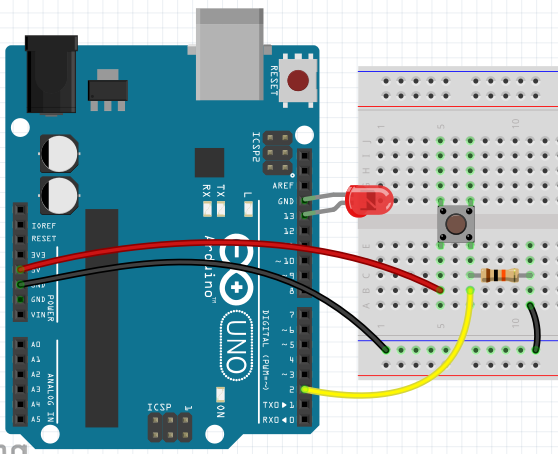

# Proyecto 3: Led con pulsador

El proyecto consiste en encender el led conectado al pin 13 de la Arduino UNO cuando se pulse el interruptor conectado al pin 2.

Esquema físico del proyecto:



Programa en ensamblador AVR:

```asm
.cseg

	; configura el pin B5 de salida (pin 13 Arduino)
	sbi		DDRB, 5

	; configura el pin D2 de entrada (pin 2 Arduino)
	cbi		DDRD, 2
	sbi		PORTD, 2			; tri stated pin ("cbi" - PORTD2=0) / pull-up pin ("sbi" - PORTD2=1)

loop:	
	in		r16, PIND			; lee todos los pines del puerto D en el registro R16
	andi	r16, 0b00000100		; comprueba si el bit 2 del puerto D ...
								; ... está activado (pin D2 = pin 2 de la Arduino)
	tst		r16					; comprueba si R16 == 0
	brne	encender			; si es distinto de 0, enciende el led
	jmp		apagar				; sino, lo apaga
	
encender:
	sbi		PORTB, 5			; activa el pin B5
	jmp		loop

apagar:
	cbi		PORTB, 5			; desactiva el pin B5
	jmp		loop
```
